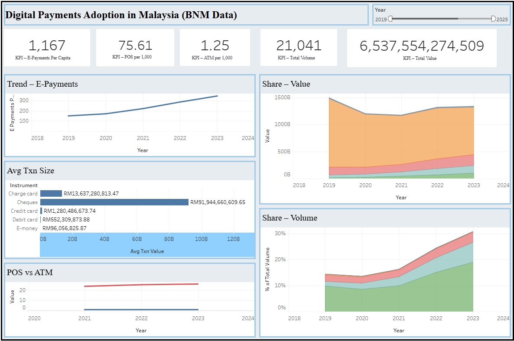

# 🏦 Digital Payments in Malaysia – Tableau Dashboard  

An interactive Tableau dashboard analyzing and visualizing **digital payment adoption trends in Malaysia**.  
This project leverages data published by **Bank Negara Malaysia (BNM) Payment Statistics** to understand:  
- Cashless adoption  
- Growth in transaction volume & value  
- Infrastructure readiness (POS terminals & ATMs)  

🔗 **Live Tableau Dashboard**: [View on Tableau Public](https://public.tableau.com/views/DigitalPaymentsAdoptioninMalaysiaBNMData/Dashboard1?:language=en-US&:sid=&:redirect=auth&:display_count=n&:origin=viz_share_link)  
📊 **Data Source**: [Bank Negara Malaysia – Payment Statistics](https://www.bnm.gov.my/payment-statistics)  

---

## 🚀 Features  

- ✅ Tableau interactive dashboard (*3 sections: Overview, Instruments, Infrastructure*)  
- ✅ Year & instrument filters for dynamic analysis  
- ✅ KPIs for e-payments per capita, POS density, and transaction insights  
- ✅ Clear, professional visual storytelling suitable for portfolio presentation  

---

## 📊 Data Overview  

The dashboard uses datasets derived from **Bank Negara Malaysia’s Payment Statistics**:  

- **T1 →** E-payments per capita (BNM Table 7.1)  
- **T2 →** Transaction volume & value by instrument (BNM Table 7.2)  
- **T5 →** POS & ATM terminals per 1,000 population (BNM Table 7.5)  

📌 **Reference:**  
Bank Negara Malaysia. (2025). *Payment Statistics*. Retrieved from  
👉 [https://www.bnm.gov.my/payment-statistics](https://www.bnm.gov.my/payment-statistics)  

---

## 📈 Insights & Key Findings  

- 📌 **Cashless adoption is accelerating** — E-payments per capita grew significantly between 2021 and 2023.  
- 📌 **POS terminal density is improving** — Terminals per 1,000 people increased steadily, supporting Malaysia’s cashless economy goals.  
- 📌 **ATM usage is declining** — A sign of the transition away from cash reliance.  
- 📌 **COVID-19 impact** — A visible spike in digital payments adoption after the pandemic years.  

➡️ These findings highlight **Malaysia’s rapid shift towards a cashless economy**, creating opportunities for **fintech innovation and digital financial services**.  

---

## 🧠 Techniques & Cool Features Used  

### 🔹 Data Processing (Python + Pandas)  
- Cleaned and standardized datasets with inconsistent year ranges  
- Unified column naming conventions for merging  
- Converted monetary units (RM millions → RM)  
- Reshaped transaction data (wide → long format)  

### 🔹 Visualization & Dashboard (Tableau)  
- KPI cards for headline insights  
- Stacked area charts to show instrument share over time  
- Line charts for e-payments per capita & POS/ATM density  
- Bar charts for average transaction size by instrument  
- Interactive filters (year)  

### 🔹 Portfolio Enhancements  
- Published Tableau dashboard to **Tableau Public** for easy sharing  
- Designed clean, minimal layout with focus on **storytelling through data**  

---

## 🛠️ Challenges Faced  

- 🔹 **Inconsistent Year Ranges**  
  - Each dataset (T1, T2, T5) covered slightly different time spans  
  - Solved via Python preprocessing to align years before loading into Tableau  

- 🔹 **Multiple Metrics with Different Scales**  
  - Volume, value, and infrastructure metrics varied widely  
  - Solved by separating into dedicated dashboard sections with tailored visualizations  

---

## 📌 Tech Stack  

- **Data Processing:** Python, Pandas, NumPy  
- **Visualization & Dashboard:** Tableau  
- **Version Control:** Git, GitHub  

---

## 📸 Screenshots  

 

---

## ✅ Conclusion  

This project demonstrates how **open central bank data** can be transformed into a clear, interactive dashboard that tracks **digital payments adoption in Malaysia**.  

Key conclusions:  
- E-payments per capita are rising fast, signaling consumer adoption.  
- ATM reliance is shrinking, reinforcing the **cashless economy trend**.  
- POS infrastructure is expanding, supporting nationwide accessibility.  

From a portfolio perspective, this project highlights skills in **data wrangling, KPI design, and Tableau storytelling**, as well as the ability to translate raw financial statistics into **insightful, decision-ready dashboards**.  

---

## 🌍 How to View the Dashboard  

1. Open the live Tableau Public link:  
   👉 [View Dashboard](https://public.tableau.com/views/DigitalPaymentsAdoptioninMalaysiaBNMData/Dashboard1?:language=en-US&:sid=&:redirect=auth&:display_count=n&:origin=viz_share_link)  
2. Navigate across the **three sections**:  
   - **Overview** → Headline KPIs & overall trends  
   - **Instruments** → Payment methods adoption & average transaction sizes  
   - **Infrastructure** → POS/ATM availability per 1,000 inhabitants  

---

## 👨‍💻 Author  

**Jony Jing**  
💼 Data Management & Analytics (Master’s)  
📧 Email: `jonyjing0620@gmail.com`  
🌐 Portfolio: [To-My-Portfolio](https://datascienceportfol.io/jonyjing)  

---

✦ Copy-paste friendly repo clone command:  
```bash
git clone https://github.com/Jony-Jing/digital-payments-dashboard.git
```

---
